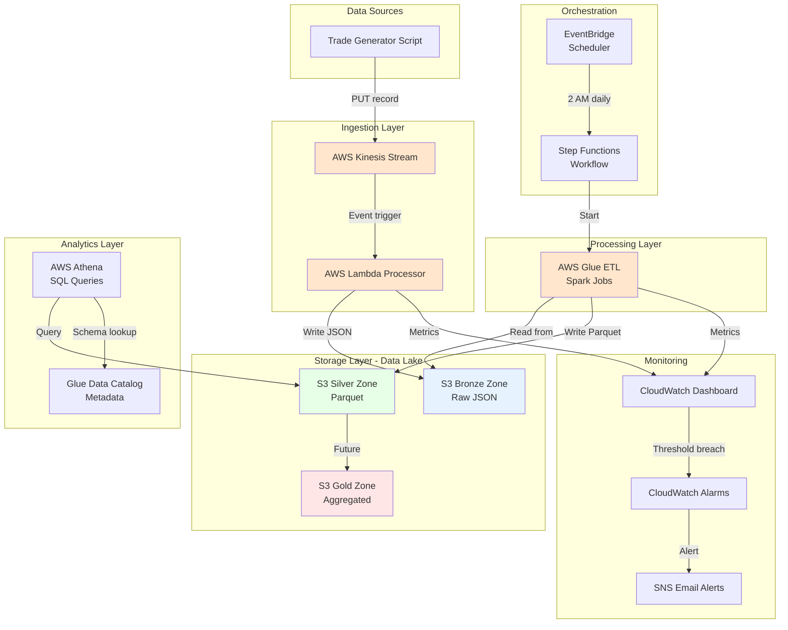

# Architecture Documentation

## System Architecture Diagram

## Component Details

### Real-Time Streaming Pipeline
- **Kinesis Stream:** 1 shard = 1 MB/sec write, 2 MB/sec read
- **Lambda:** Python 3.11, 128 MB RAM, 60s timeout
- **Latency:** ~200ms (event → S3)

### Batch Processing Pipeline
- **Glue ETL:** 2 DPU workers, G.1X type
- **Schedule:** Daily at 2 AM UTC via EventBridge
- **Processing:** Bronze (JSON) → Silver (Parquet)
- **Compression:** ~80% reduction

### Data Lake Zones

| Zone | Format | Purpose | Retention |
|------|--------|---------|-----------|
| Bronze | JSON | Raw immutable source data | Forever |
| Silver | Parquet | Cleaned, validated, deduplicated | 2 years |
| Gold | Parquet | Business aggregations | 1 year |

### Monitoring & Alerts

**CloudWatch Alarms:**
- Lambda errors > 5 in 5 minutes
- Glue job failures
- Large trades > 3 in 1 minute

**Metrics Tracked:**
- Kinesis: IncomingRecords, IncomingBytes
- Lambda: Invocations, Errors, Duration
- Glue: Completed tasks, Failed tasks

## Data Flow

### Real-Time Path (Event-Driven)
Trade event generated
Sent to Kinesis stream (partition key = symbol)
Lambda auto-triggered within 50ms
Lambda validates trade:

Check required fields exist
Validate quantity > 0, price > 0
Detect large trades (quantity > 5000)

Enrich with metadata:

processed_at timestamp
kinesis_sequence number

Write to S3 Bronze:
s3://bucket/bronze/trades/year=2026/month=04/day=26/trade_T123.json

### Batch Path (Scheduled)

EventBridge rule triggers at 02:00 UTC
Starts Step Functions state machine
Step Functions executes Glue job
Glue job (PySpark):

Reads all JSON from Bronze zone
Validates: removes nulls, invalid values
Deduplicates by trade_id
Converts to Parquet format
Partitions by year/month/day
Writes to Silver zone

Step Functions checks job status
Logs success/failure

## Technology Decisions

### Why Kinesis (not Kafka)?
- AWS-native integration with Lambda
- Managed service (no broker maintenance)
- Sufficient for current throughput (< 1 MB/sec)
- 24-hour retention for replay capability

### Why Lambda (not EC2)?
- Serverless (no infrastructure management)
- Auto-scaling to zero
- Pay per execution ($0.20 per 1M requests)
- Sub-second event processing

### Why Glue (not EMR)?
- Serverless Spark (no cluster management)
- Job bookmarks for incremental processing
- Integrated with Glue Data Catalog
- Good for standard ETL patterns

### Why Athena (not Redshift)?
- Pay-per-query model ($5/TB scanned)
- No infrastructure costs when idle
- Queries data in-place (no ETL to warehouse)
- Perfect for ad-hoc analytics

### Why Step Functions (not Airflow)?
- Native AWS service integration
- Visual workflow monitoring
- Error handling and retry logic built-in
- Lower operational overhead for simple workflows

## Security & Compliance

### IAM Roles (Least Privilege)
- Lambda: Read Kinesis, Write S3, Write CloudWatch Logs
- Glue: Read/Write S3, Read Glue Catalog
- Step Functions: Start Glue jobs
- EventBridge: Start Step Functions

### Data Encryption
- S3: Server-side encryption (AES-256)
- Kinesis: In-transit encryption (HTTPS)
- Athena: Query results encrypted

### Audit Trail
- CloudTrail: All API calls logged
- S3 Versioning: Data recovery capability
- CloudWatch Logs: All Lambda executions

## Scalability

### Current Capacity
- 1,000 trades/second (1 Kinesis shard)
- 100 GB/month data volume
- 20 trades in test dataset

### Scale to Production
- Add Kinesis shards (10 shards = 10,000 trades/sec)
- Increase Glue DPUs (10 DPUs = 10x faster)
- Add Step Functions for parallel processing
- Enable S3 lifecycle policies for archival

## Disaster Recovery

### Backup Strategy
- S3 Bronze: Source of truth, never deleted
- S3 Versioning: Recover from accidental deletes
- Cross-region replication: Planned for prod

### Recovery Procedures
1. Lambda failure → Kinesis retains data 24h, replay possible
2. Glue job failure → Automatic retry in Step Functions
3. Data corruption → Reprocess from Bronze zone
4. Complete failure → Redeploy via Terraform from git

## Cost Optimization

### Current Optimizations
- Parquet format (80% compression vs JSON)
- Partition pruning (query only needed dates)
- Serverless (pay per use, not per hour)
- S3 Intelligent-Tiering (automatic cost optimization)

### Future Optimizations
- S3 Glacier for old Bronze data (90% cheaper)
- Glue job bookmarks (skip processed data)
- Athena partition projection (faster queries)
- Reserved capacity for Redshift (if needed)

Step 3: Add Visual Diagram to README
Edit README.md - add after "Architecture" section:
markdown## 🏗️ Architecture

**[View detailed architecture documentation →](docs/architecture.md)**

Step 4: Create Simple Visual Diagram
Create file: docs/ARCHITECTURE_VISUAL.md (for easy copy-paste):
markdown# Visual Architecture

Copy this into draw.io or Lucidchart:

## Components to Draw:

**Layer 1: Data Sources (Top)**
- Box: "Trading Systems / Trade Generator"

**Layer 2: Ingestion**
- Box: "Kinesis Stream" (orange)
- Box: "Lambda Processor" (orange)

**Layer 3: Storage**
- Box: "S3 Bronze (JSON)" (light blue)
- Box: "S3 Silver (Parquet)" (light green)
- Box: "S3 Gold (Aggregated)" (light yellow)

**Layer 4: Processing**
- Box: "Glue ETL (Spark)" (orange)

**Layer 5: Orchestration**
- Box: "EventBridge (Scheduler)" (purple)
- Box: "Step Functions (Workflow)" (purple)

**Layer 6: Analytics**
- Box: "Athena (SQL)" (green)
- Box: "Glue Data Catalog" (green)

**Layer 7: Monitoring**
- Box: "CloudWatch Dashboard" (red)
- Box: "SNS Alerts" (red)

## Arrows:
1. Trading Systems → Kinesis
2. Kinesis → Lambda
3. Lambda → S3 Bronze
4. EventBridge → Step Functions
5. Step Functions → Glue ETL
6. Glue ETL → S3 Bronze (read)
7. Glue ETL → S3 Silver (write)
8. Athena → S3 Silver (query)
9. CloudWatch ← Lambda, Glue (metrics)
10. SNS ← CloudWatch (alerts)